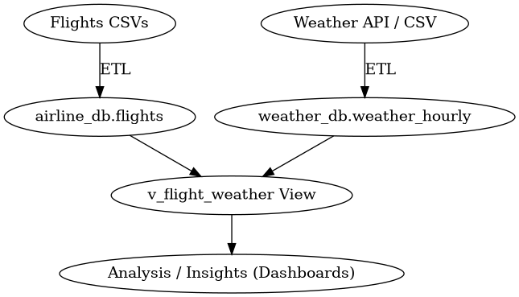
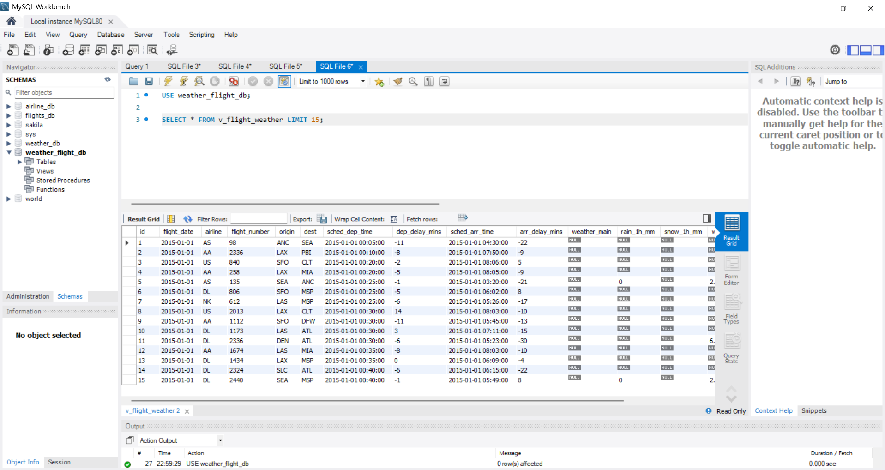

# Weather Impact on Flight Delays ✈️🌦️

Analyze how weather conditions impact flight delays by integrating flight data with hourly weather and producing a clean joined view for analysis.

---

## 🧰 Tech Stack
- **Python** – ETL scripts (Flights & Weather)
- **MySQL** – `airline_db`, `weather_db`
- **Spark (optional)** – batch transform/join (`spark/jobs/`)
- **Airflow (optional)** – orchestration placeholder (`airflow/dags/`)

---

## 📁 Project Structure

```
.
├─ .github/workflows/ci.yml        # (optional) CI
├─ airflow/
│  └─ dags/
│     └─ flight_weather_dag.py     # optional, not required to run
├─ assets/                         # screenshots / diagrams
├─ configs/
│  ├─ db.example.env               # template for DB env vars
│  └─ openweather.env.example      # template for API env vars
├─ data/
│  ├─ raw/                         # (gitignored)
│  └─ processed/                   # (gitignored)
├─ etl/
│  ├─ common/
│  │  ├─ db.py                     # DB helpers
│  │  └─ utils.py                  # shared utilities
│  ├─ flights/
│  │  └─ extract_transform_load.py # Flights ETL
│  └─ weather/
│     └─ extract_transform_load.py # Weather ETL
├─ spark/
│  └─ jobs/
│     └─ join_and_agg.py           # optional Spark job
├─ sql/
│  ├─ schema_airline_db.sql        # create tables for flights
│  ├─ schema_weather_db.sql        # create tables for weather
│  └─ create_view_v_flight_weather.sql  # final joined view
├─ .gitignore
├─ README.md
├─ requirements.txt
└─ (your local) .env                # DO NOT COMMIT
```

> Secrets are **never** committed. Use `.env` locally and keep sample keys in `configs/*.example`.

---

## 🔑 Configuration

1) **Create your local `.env`** (don’t commit it). Use these names:
```
MYSQL_HOST=localhost
MYSQL_PORT=3306
MYSQL_USER=your_user
MYSQL_PASSWORD=your_password
MYSQL_DB_AIRLINE=airline_db
MYSQL_DB_WEATHER=weather_db
OPENWEATHER_API_KEY=your_key_if_used
```

2) **Install dependencies**
```bash
python -m venv .venv
# Windows:
.venv\Scripts\activate
# macOS/Linux:
source .venv/bin/activate

pip install -r requirements.txt
```

---

## 🗄️ Database Setup

1) Start MySQL and create schemas/tables:
```sql
-- Run both files in your MySQL client:
-- sql/schema_airline_db.sql
-- sql/schema_weather_db.sql
```

2) (Optional) Verify empty tables exist:
```sql
SHOW TABLES FROM airline_db;
SHOW TABLES FROM weather_db;
```

---

## 🚚 Run ETL

1) **Flights ETL**
```bash
python etl/flights/extract_transform_load.py
```

2) **Weather ETL**
```bash
python etl/weather/extract_transform_load.py
```

These scripts will populate `airline_db` and `weather_db` (tables defined in the schema SQL).

---

## 🔗 Create the Joined View

Run:
```sql
-- sql/create_view_v_flight_weather.sql
CREATE OR REPLACE VIEW v_flight_weather AS
SELECT
  f.*,
  w.weather_main,
  w.rain_1h_mm,
  w.snow_1h_mm,
  w.wind_speed_ms,
  w.pressure_hpa
FROM airline_db.flights f
LEFT JOIN weather_db.weather_hourly w
  ON w.airport = f.origin
 AND w.ts_hour = DATE_FORMAT(f.sched_dep_time, '%Y-%m-%d %H:00:00');
```

Quick check:
```sql
SELECT * FROM v_flight_weather LIMIT 20;
```

---

## 📊 Example Queries

- **Delay vs. Weather condition**
```sql
SELECT weather_main,
       AVG(CASE WHEN dep_delay_min > 0 THEN dep_delay_min ELSE 0 END) AS avg_dep_delay_min,
       COUNT(*) AS flights
FROM v_flight_weather
GROUP BY weather_main
ORDER BY avg_dep_delay_min DESC;
```

- **Airport-wise delay on rainy hours**
```sql
SELECT origin,
       COUNT(*) AS flights,
       AVG(dep_delay_min) AS avg_delay
FROM v_flight_weather
WHERE rain_1h_mm IS NOT NULL AND rain_1h_mm > 0
GROUP BY origin
ORDER BY avg_delay DESC;
```

---

## 🧪 Future Work

- **Spark Job** (`spark/jobs/join_and_agg.py`): a starter script is included. Can be extended for batch joins/aggregations.  

- **Airflow** (`airflow/dags/flight_weather_dag.py`): placeholder DAG included for future scheduling. Not required for the current project but can be used later for automation.  

---


---

### 📌 So your **Assets section** should look like this:
```markdown
## 🖼️ Assets

- 
- 

Mermaid diagram (GitHub renders it):

```mermaid
flowchart LR
  A[Flights CSVs] -->|ETL| B[(airline_db.flights)]
  C[Weather API/CSV] -->|ETL| D[(weather_db.weather_hourly)]
  B --> E[v_flight_weather]
  D --> E
  E --> F[Analysis / Insights]

---

## 🛣️ Roadmap
- Add KPI dashboards (delay rate vs. weather)
- Airport leaders/laggards report
- Scale-out with Spark jobs for larger months/years
- (Later) Schedule with Airflow and add data quality checks

---

## 🔐 Notes
- Real API keys/passwords must stay only in your local `.env`.
- `.env.example` in `configs/` shows the expected variable names.

---

## 📜 License
MIT
